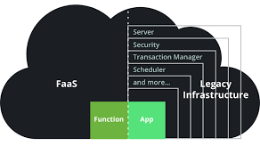

---
output:
  xaringan::moon_reader:
    seal: false
    lib_dir: libs
    css: ["default", "rladies-fonts", "resources/css/progress.css", "resources/css/adds.css"]
    nature:
      ratio: "16:9"
      highlightStyle: github
      highlightLines: true
      countIncrementalSlides: false
      slideNumberFormat: |
        <div class="progress-bar-container">
          <div class="progress-bar" style="width: calc(%current% / %total% * 100%);">
          </div>
        </div>
---

```{r setup, include=FALSE}

knitr::opts_chunk$set(message = FALSE, 
                      warning = FALSE, 
                      fig.retina = 3)

```

class: inverse, left, middle

background-image: url(resources/images/cover.gif)
background-size: cover

# IBM Cloud Functions com R


.large[Thiago Pires | 12 Nov 2021]

---
layout: true

background-image: url(resources/images/logo-ibm.png)
background-position: 97% 3%
background-size: 7%

---
class: left middle
background-color: #00b33c

# Introdução

---
# Introdução

A computação sem servidor (*serverless computing*) é um recurso útil para executar na nuvem. Tendo como vantagem:

- Menor custo
- Redução no tempo de gerenciamento
- Facilidade na configuração e implementação.
- Escalabilidade

### Function-as-a-Service (FaaS)

```{r echo=FALSE, out.width="45%", fig.align='center'}

```

---
# Apache OpenWhisk

A plataforma FaaS na IBM Cloud é um recurso para executar código sob demanda com solicitações de API baseadas em HTTP. O IBM Cloud Functions é baseado no projeto de código aberto Apache OpenWhisk.

```{r echo=FALSE, out.width="50%", fig.align='center'}
knitr::include_graphics("resources/images/openwhisk-flow.png")
```

---
class: left middle
background-color: #b8b8b8

# Configuração e Deploy

---
# Configuração

Para criar uma IBM Cloud Function com R é necessário configurar 3 arquivos:

- `exec`: script que irá receber os parâmetros de input e executar um script.R
- `Dockerfile`: imagem com `openwhisk/dockerskeleton` e instalação do R, dependências e bibliotecas.
- `script.R`: script que será excutado pela IBM Function com o código em R.


### `exec`
```
#!/bin/bash
chmod +x script.R # turn executable
echo "$@" > input.json # set input
./script.R # run script
```

### `Dockerfile`
```
FROM openwhisk/dockerskeleton
RUN apk update && apk add R R-dev R-doc build-base
RUN R -e "install.packages(c('jsonlite', 'tidypredict', 'yaml'), 
repos = 'http://cran.rstudio.com/')"
```

---
# Configuração

### `script.R`
```
#!/usr/bin/env Rscript

# carregar modelo
loaded_model <-
  tidypredict::as_parsed_model(yaml::read_yaml("my_model.yml"))
# input
input <- jsonlite::fromJSON("input.json", flatten = FALSE)
# calcular predição
pred <- 
  tidypredict::tidypredict_to_column(as.data.frame(input), loaded_model)
# output
jsonlite::stream_out(pred, verbose = FALSE)
```

---
# Deploy

- Foi ajustado um modelo com o banco de dados do Titanic usando a biblioteca `tidymodels`

- Uma regressão logística foi utilizada para classificar os passageiros em sobreviventes ou não ao desastre do Titanic.

- As variáveis selecionadas foram Sexo e Pclass.

```{r eval=FALSE}
library(tidymodels)
library(magrittr)

lr_mod <- logistic_reg() %>% set_engine("glm")
lr_fit <- lr_mod %>% fit(Survived ~ Sex + Pclass, data = train_data)
```

- Salvar o modelo em um arquivo `yaml`

```{r eval=FALSE}
yaml::write_yaml(tidypredict::parse_model(lr_fit),"R/my_model.yml")
```

---
# Deploy

Para deploy do modelo são necessários os seguintes passos:

- Build e push para o Docker Hub.

```
docker build th1460/titanic .
docker push th1460/titanic
```

- Logar na IBM Cloud e empacotar os arquivos `exec`, `script.R` e `my_model.yml`.

```
ibmcloud login
ibmcloud target --cf
zip -r titanic.zip exec script.R my_model.yml
```

- Crie a Função declarando `--web true` para transformá-la em uma API.

```
ibmcloud fn action create titanic titanic.zip --docker th1460/titanic --web true
```

---
class: left middle
background-color: #fef24e

# Resposta

---
# Resposta

Para solicitar uma previsão via API, você pode usar a função do pacote `httr`.

```{r eval=FALSE}
input <- list(Sex = "male", Pclass = "3rd")
"https://<APIHOST>/api/v1/web/<NAMESPACE>/default/titanic.json" %>% 
httr::POST(., body = input, encode = "json") %>% httr::content() %>% 
.[c("Sex", "Pclass", "fit")] %>% jsonlite::toJSON(pretty = TRUE, auto_unbox = TRUE)
```

### Resposta ao *request*:

```
{"Sex": "male", "Pclass": "3rd", "fit": 0.0979}
```

---
class: left middle
background-color: #6699cc

# Custos e Conclusão

---
# Custos

O Cloud Functions é eficiente quando altamente utilizado (**escalando sem interrupção até 10000 solicitações paralelas**)

$$
\text{Taxa básica de custo}=\$0.000017\,\text{GB/s}
$$

```{r echo=FALSE}
dplyr::tibble(
  `Tempo de execução (ms)` = c(rep(500, 3), rep(1000, 3)),
  `Memória (MB)` = c(128, 256, 512, 128, 256, 512),
  `Execuções (mês)` = c(rep(5000000, 3), rep(10000000, 3)),
  `Custo (mês)` = c("Grátis", "$3.83", "$14.45", "$14.45", "$35.70", "$78.20")
) |> reactable::reactable()
```


---
# Conclusão

A IBM Cloud Function é um recurso incrível para qualquer linguagem de programação. **É fácil de configurar, implantar e escalar.** Se este recurso corresponder às necessidades do seu projeto (disponibilidade, frequência de solicitações, etc). Deve ser uma escolha interessante **executar uma função sem servidor com R em produção.**

---
class: left middle
background-color: white

# Demo

---
class: center middle
background-color: white

.pull-left[
# Obrigado
]
.pull-right[
#### github.com/th1460
#### linkedin.com/in/thop
#### twitter.com/th14600
#### th1460.github.io
]